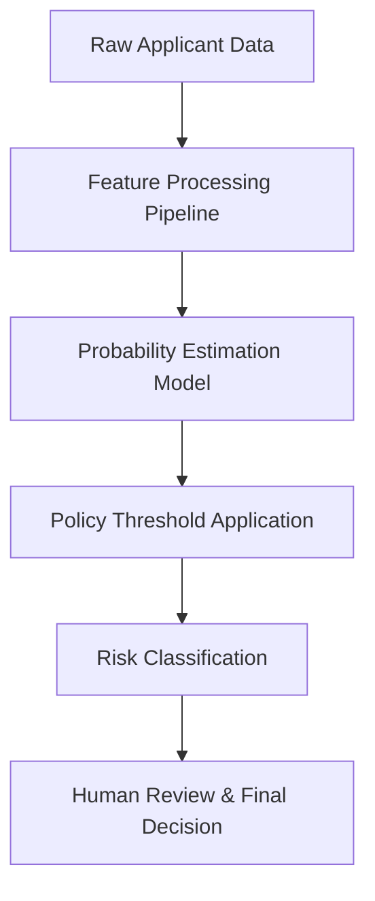

# Credit Risk Assessment Platform (CRAP)

## Overview

The **Credit Risk Assessment Platform (CRAP)** is a production-oriented machine learning system designed to support retail credit decisioning.  

The project demonstrates how predictive models are integrated with business policy, governance, and deployment considerations in a realistic financial environment.

Rather than focusing solely on model accuracy, this system emphasizes **decision transparency, policy control, reproducibility, and auditability**, reflecting how credit risk models are used in practice.

---
## Live Application

Access the deployed **Credit Risk Assessment Platform** here:  **[CRAP Application](https://creditriskplatform.streamlit.app/)**

---
## Production interface


---
## Project Scope

This repository covers the **full lifecycle** of a credit risk system:

- Data preparation and feature handling
- Model training and validation
- Probability-based risk estimation
- Policy-driven decision logic
- Deployment-ready artifacts
- End-user decision-support interface
- Documentation and governance boundaries

The project is intentionally designed as a **complete system**, not a standalone model.

---

## System Objectives

- Estimate the probability that an applicant demonstrates **good credit behavior**
- Separate **model prediction** from **business decisioning**
- Enable configurable, policy-based risk classification
- Ensure deterministic, repeatable outcomes
- Support human oversight and regulatory compliance
- Provide a deployable and maintainable implementation

---

## High-Level Architecture


---

The model produces **probabilities only**.  
All approval logic is governed by **policy**, not hard-coded rules or the model itself.

---

## Model Design (Conceptual)

- The model is trained as a **multiclass credit quality classifier**
- Internal credit quality states:
  - Poor
  - Standard
  - Good
- Operational output:
  - **Low Risk** → Good
  - **High Risk** → Poor + Standard

This abstraction mirrors real financial systems, where internal risk grades are mapped to operational decisions through policy.

---

## Decision Logic

1. The model predicts the probability that an applicant belongs to the *Good* credit class.
2. A configurable policy threshold is applied.
3. If the probability meets or exceeds the threshold:
   - The applicant is classified as **Low Risk**
4. Otherwise:
   - The applicant is classified as **High Risk**
   - Manual review is recommended

This approach avoids automatic approvals or rejections and supports controlled decision-making.

---

## Data & Feature Handling

- Features are explicitly categorized and processed through a reproducible pipeline
- Categorical values are encoded consistently
- Numerical features are scaled
- The preprocessing pipeline is saved alongside the model to prevent inference mismatches

All transformations applied during training are reused during deployment.

---

## Deployment & Reproducibility

- Model artifacts are serialized using `joblib`
- Training and deployment environments are version-aligned
- Dependency versions are pinned to ensure reproducibility
- The system is designed for deterministic behavior across environments

The project intentionally avoids experimental shortcuts in favor of stability.

---

## User Interface (Decision Support)

A Streamlit-based interface is provided to demonstrate how the system can be consumed by end users such as:
- Credit analysts
- Risk officers
- Underwriters

The interface includes:
- Policy configuration controls
- Embedded system documentation
- Clear explanations of decisions and limitations
- Explicit governance notices

The UI is a **delivery mechanism**, not the core of the system.

---

## Governance & Limitations

### Governance
- The system is **decision-support only**
- No automated approvals or rejections
- Human oversight is mandatory
- Policy thresholds are configurable and explicit

### Limitations
- Unreported liabilities are not captured
- Sudden life events are not reflected
- Predictions are based on historical behavior
- Model performance may degrade over time without monitoring

These constraints are documented to prevent misuse.

---

## Repository Structure

High-level layout of the project:

```text
CRAP/
│
├── app/
│   └── app.py
│       # Production-ready decision-support application
│       # Provides risk assessment, policy configuration,
│       # and embedded system documentation
│
├── data/
│   ├── cleaned_data.csv
│   │   # Cleaned and validated dataset after initial preprocessing
│   │
│   ├── processed_data.csv
│   │   # Fully processed dataset used for model training
│   │   # (encoding, feature engineering, transformations applied)
│   │
│   └── train.csv
│       # Training split used during model development and evaluation
│
├── model/
│   ├── model.pkl
│   │   # Serialized trained model and preprocessing pipeline
│   │   # Used directly by the deployed application
│   │
│   └── train.py
│       # End-to-end training script
│       # Includes preprocessing, feature handling,
│       # model training, and artifact persistence
│
├── notebooks/
│   ├── 01_Data_Exploration_&_Cleaning.ipynb
│   │   # Initial data understanding, cleaning, and validation
│   │
│   ├── 02_EDA_&_Visualization.ipynb
│   │   # Exploratory data analysis and statistical insights
│   │
│   └── 03_Credit_Risk_Prediction.ipynb
│       # Model experimentation, evaluation, and iteration
│
├── outputs/
│   └── creditrisk.mp4
│       # Demonstration video showcasing the deployed application
│
├── requirements.txt
│   # Locked dependency versions for reproducible training and deployment
│
├── .gitignore
│   # Git ignore rules
│
└── README.md
    # Project documentation
```
---

## Intended Use Cases

- Credit application pre-screening
- Risk segmentation
- Underwriter decision support
- Demonstration of applied machine learning in finance
- Educational reference for production ML systems

---

## Disclaimer

> This project is provided for **educational and demonstration purposes only**.  
It is not intended for real-world credit decisioning without appropriate validation, regulatory approval, and institutional governance.

---
## Installation & Setup

Follow the steps below to set up your environment and run the project.

---

### 1. Clone the Repository
```bash
git clone https://github.com/engalaagabr/CRAP.git
cd CRAP
```
### 2.Create a Virtual Environment (Recommended)
```bash
python -m venv venv

# macOS / Linux
source venv/bin/activate

# Windows
venv\Scripts\activate
```
---
### 3. Install Project Dependencies

All required libraries are listed in requirements.txt.
```bash
pip install -r requirements.txt
```
---
THX
